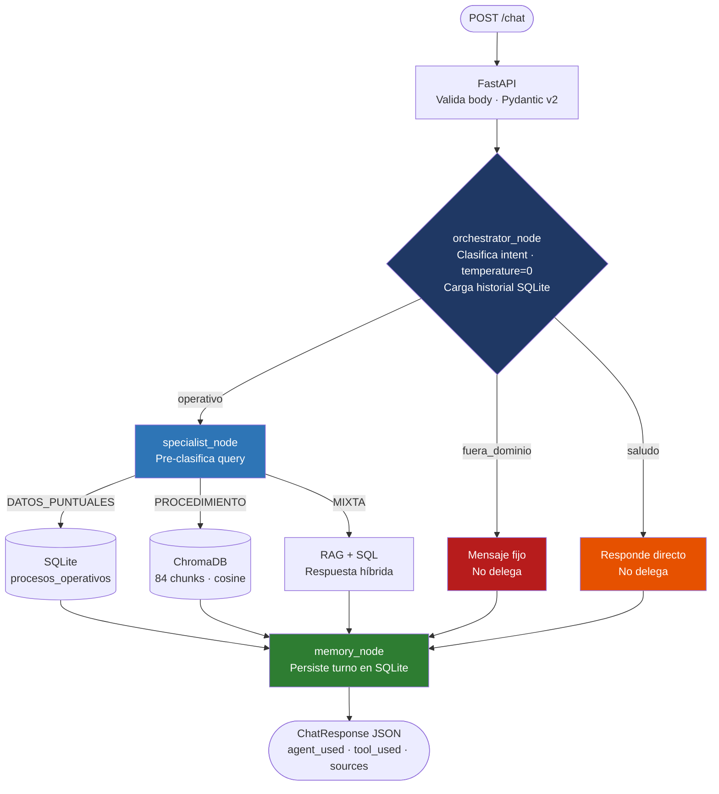

# Banorte — Agente Conversacional de Políticas Operativas

[](https://github.com/erikth97/Agente-Conversacional/actions/workflows/ci.yml)

Asistente conversacional interno para empleados de Banorte. Resuelve consultas sobre procesos operativos sin buscar en PDFs ni interrumpir a compañeros — con trazabilidad completa de cada respuesta.

---

## ¿Qué hace?

Un empleado puede preguntar *"¿cuánto tiempo tarda una aclaración de cargo?"*, *"explícame los pasos del proceso de escalamiento"* o *"¿quién es responsable de las quejas internas y cuántos días tarda?"* — y recibe una respuesta que cita explícitamente la política operativa consultada.

El sistema cubre cinco procesos: aclaraciones, cancelación de productos, escalamiento de incidencias, actualización de datos y gestión de quejas. Preguntas fuera de ese dominio reciben un rechazo claro; el asistente nunca inventa información. Las respuestas se generan en español formal, orientadas a empleados de instituciones financieras en México.

---

## Arquitectura



Separar orquestador y especialista no es una decisión técnica arbitraria: en un contexto bancario, cada respuesta debe ser trazable a una fuente concreta. El orquestador decide *si* responder; el especialista decide *cómo* responder usando herramientas verificables. Si el orquestador detecta que la pregunta está fuera del dominio, nunca llega al especialista — no hay oportunidad de alucinación.

---

## Decisiones de diseño que marcaron el rumbo

| Decisión | Razonamiento |
|----------|-------------|
| **Dos agentes separados (LangGraph)** | Un agente único mezcla clasificación con generación — imposible auditar dónde falló. El grafo hace el flujo explícito y testeable por nodo. |
| **RAG_MIN_SCORE = 0.70** | Validado empíricamente: queries relevantes producen scores de 0.82+; queries irrelevantes caen a 0.57. Por debajo de 0.70 el chunk no es pertinente — se responde con mensaje de "no encontré información" en lugar de inventar. |
| **Routing interno DATOS_PUNTUALES / PROCEDIMIENTO / MIXTA** | Sin esta clasificación, el umbral RAG bloqueaba preguntas como "¿cuántos días tarda?" que la BD responde con exactitud total. El routing evita que una herramienta equivocada bloquee una respuesta correcta. |
| **SQLite + ChromaDB (no una sola BD)** | Datos estructurados (tiempos, áreas, canales) viven mejor en tablas relacionales — queries exactas, sin embeddings. Datos documentales (políticas, procedimientos) necesitan búsqueda semántica. Cada herramienta hace lo que sabe hacer. |
| **memory_node en el grafo, no en FastAPI** | Si la persistencia vive en el endpoint HTTP, se rompe al invocar el grafo directamente en tests. El `memory_node` garantiza que la memoria persiste en todos los caminos del grafo, independiente de la capa de transporte. |

---

## Comportamiento en producción bancaria

El sistema tiene tres restricciones codificadas que no se pueden desactivar:
chunks RAG con score < 0.70 se descartan (validado empíricamente: queries
relevantes producen 0.82+, queries irrelevantes 0.57); preguntas fuera del
dominio de los cinco procesos reciben rechazo explícito sin pasar por el
especialista; toda respuesta cita la política operativa consultada —
obligatorio para trazabilidad y auditoría interna.

---

## Stack tecnológico

| Capa | Tecnología | Por qué |
|------|-----------|---------|
| Orquestación de agentes | LangGraph + LangChain | Grafo explícito, routing condicional auditable |
| LLM | gpt-4o-mini (temperature=0) | Clasificación determinista; compatible con Azure OpenAI |
| Embeddings | text-embedding-3-small (1536 dims) | Mismo proveedor, calidad alta en español |
| Vector store | ChromaDB PersistentClient | Sin servidor adicional; funciona en Docker con un volumen |
| Base de datos | SQLite | Sin servidor, stdlib de Python, portable |
| API | FastAPI + Pydantic v2 | Body exacto del assessment; Swagger UI incluido |
| Configuración | python-dotenv + .env | Cero credenciales en código — obligatorio en contexto bancario |

Parámetros RAG detallados (chunk_size, overlap, top_k, etc.) con justificación de cada valor: [`docs/RAG_DESIGN.md`](docs/RAG_DESIGN.md).

---

## Cómo correrlo

### Local

```bash
git clone https://github.com/erikth97/Agente-Conversacional.git && cd Agente-Conversacional
python -m venv .venv && source .venv/bin/activate   # Windows: .venv\Scripts\activate
pip install -r requirements.txt
cp .env.example .env                                  # agregar OPENAI_API_KEY
python -c "from app.database.init_db import init; init()"
python scripts/ingest.py
uvicorn app.main:app --reload --port 8000
```

### Docker

```bash
docker build -t banorte-agent .
docker run --env-file .env -p 8000:8000 banorte-agent
```

### Ejemplo de uso

```bash
curl -s -X POST http://localhost:8000/chat \
  -H "Content-Type: application/json" \
  -d '{"conversation_id":"demo-01","user_id":"Pavel","message":{"text":"Cuanto tiempo tarda el proceso de escalamiento y quien es responsable"},"metadata":{"channel":"web","timestamp":"2026-04-19T18:30:00Z"}}'
```

```json
{
  "conversation_id": "demo-01",
  "response": "Según la política operativa de Escalamiento de Incidencias, el tiempo promedio de resolución es de 24 horas. El área responsable es la Mesa de Control Interno.",
  "agent_used": "specialist",
  "tool_used": "hybrid",
  "sources": [{"source": "proceso_C_escalamiento", "score": 0.87}],
  "timestamp": "2026-04-19T18:30:01Z"
}
```

---

## Criterios de evaluación cubiertos

| Criterio | Peso | Implementación |
|----------|------|----------------|
| Arquitectura agéntica | 20% | LangGraph StateGraph multi-agente con routing condicional explícito en `graph.py` |
| Agente Orquestador | 20% | `orchestrator_node.py` — clasifica intent, carga memoria, NO delega RAG/SQL |
| Agente Especializado | 20% | `specialist_node.py` — routing interno por tipo de query, tool calling con LangChain |
| RAG custom | 20% | `rag_tool.py` + `ingest.py` — chunking manual, ChromaDB, parámetros en `config.py` |
| BD Estructurada | 10% | `sql_tool.py` — SQLite con 5 procesos A-E |
| Memoria Conversacional | 10% | `conversation.py` + `memory_node.py` — SQLite persistente por conversation_id |
| Dockerfile funcional | +10% | `Dockerfile` + `start.sh` — init_db → ingest → uvicorn |
| Config por env vars | +5% | `app/config.py` centraliza todos los `os.getenv()` |
| README claro | +5% | Este documento |
| **Total posible** | **120%** | |

---

## Testing

Suite de tests verificada manualmente en tres niveles al completar cada fase.

**Nivel 1 — Routing del grafo (7/8 casos):** queries operativas llegan al especialista; saludos y preguntas fuera del dominio son resueltos por el orquestador sin delegar. El caso borderline documentado: queries ambiguas donde RAG y SQL son igualmente válidos — el sistema elige correctamente aunque por un camino diferente al esperado.

**Nivel 2 — Reglas de comportamiento (12/12):** fuera de dominio rechazado con mensaje fijo en 4/4 casos; proceso inexistente respondido sin inventar; toda respuesta del especialista cita la fuente explícitamente.

**Nivel 3 — Memoria conversacional (5/5):** historial persiste entre invocaciones directas del grafo y via HTTP; conversaciones distintas aisladas correctamente; contexto previo activo en el segundo turno.
